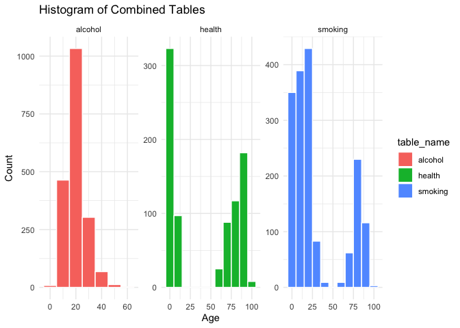
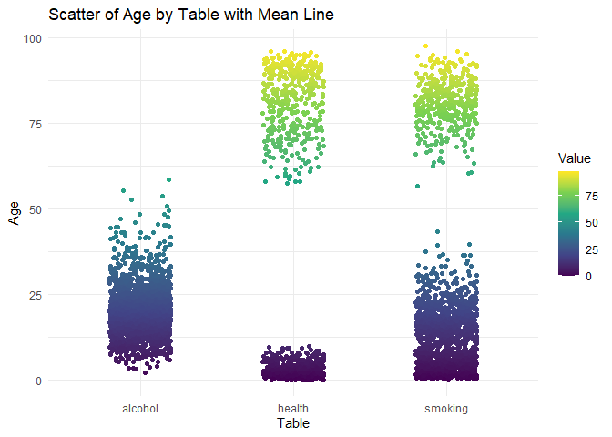

<!-- README.md is generated from README.Rmd. Please edit that file -->

``` r
knitr::opts_chunk$set(
  collapse = TRUE,
  comment = "#>",
  fig.path = "man/figures/README-",
  out.width = "100%"   
)
```

# lifeRstyle

<!-- badges: start -->

<!-- badges: end -->

## Description

**lifeRstyle** is an R package designed to download, clean, and analyse
Irish lifestyle and health data from the Central Statistics Office
(CSO). The package focuses on indicators such as:

Smoking habits

Alcohol consumption

General health and wellbeing

It provides a tidy, user-friendly workflow for loading data, visualising
trends, and fitting statistical models.

Three core functions are provided:

1.  `Load_LifeRStyle()` – for downloading and preparing CSO lifestyle
    data.

2.  A `plot()` function – for producing visualisations using `ggplot2`.

3.  A `fit()` method – for fitting statistical models (linear
    regression, ANOVA, mixed-effects models) to said data.

Typically, these functions are applied sequentially. A demonstration of
the typical workflow is shown below.

## Installation

You can install the development version of lifeRstyle from
[GitHub](https://github.com/) with:

``` r
# install.packages("pak")
pak::pak("DavidF2021/lifeRstyle")
```

## Example

We are showing how to load lifestyle data and perform a simple analysis:

``` r
library(lifeRstyle)

data <- lifeRstyle::combined_cleaned
```

Histogram of Combined Tables.

This histogram shows the distribution of Age values in the combined
dataset, separated into three panels for alcohol, health, and smoking.
Each bar represents how many observations fall into an age range within
that table. It helps compare whether the age coverage is similar or
different across the three datasets. The alcohol and smoking tables
appear more concentrated in certain age ranges, while health shows a
wider spread. Overall, it summarises the age structure of the combined
data by table type.

Boxplot of Values by Age.

This boxplot compares the Age distribution across alcohol, health, and
smoking using summary statistics rather than individual points. The
median line shows the typical age in each table, and the box shows the
middle 50% of ages (IQR). The whiskers extend to the main range of the
data, while dots represent outliers. It highlights that the health table
has a much wider age range than the others. This plot is useful for
quickly spotting differences in spread and unusual age values between
tables.

Scatter of Age by Table with Mean Line

This scatter plot shows individual observations of Age grouped by table
(alcohol, health, smoking) along the x-axis. Each point represents one
record, and the colour scale reflects the Value column, allowing
patterns between age and value to be seen. The clustering of points
indicates which age ranges dominate each table and where the data is
concentrated. The mean line provides a reference for the average trend
within each table group. Overall, it gives a detailed view of
variability and how values change across ages in the combined dataset.

``` r
plot_combined_data(data)
#> $histogram
```



    #> 
    #> $boxplot


    #> 
    #> $scatter



This output shows the results of a linear regression model fitted as
value ~ Sex + Age.Group + Year. The residual summary (Min, 1Q, Median,
3Q, Max) describes how far the predicted values are from the observed
values. The coefficients table gives the estimated effect of each Sex
and Age.Group category (relative to a reference group), plus the effect
of Year. Most predictors have high p-values, meaning there is no strong
evidence that Sex, Age.Group, or Year significantly explain variation in
value in this dataset. The very low R-squared (0.00185) and
non-significant F-test p-value (0.9443) indicate the model fits poorly
and explains almost none of the variability in value.

``` r
model <- fit_lifeRstyle(data, fit_type = "lm")
summary(model) 
#> 
#> Call:
#> stats::lm(formula = value ~ Sex + Age.Group + Year, data = obj)
#> 
#> Residuals:
#>     Min      1Q  Median      3Q     Max 
#> -29.894 -17.129  -9.828   0.661  70.149 
#> 
#> Coefficients:
#>                             Estimate Std. Error t value Pr(>|t|)
#> (Intercept)                230.30539  247.86456   0.929    0.353
#> SexFemale                   -0.20653    1.01806  -0.203    0.839
#> SexMale                      0.21313    1.01806   0.209    0.834
#> Age.Group20 - 24 years       1.07206    2.19927   0.487    0.626
#> Age.Group25 - 29 years       1.41492    2.19927   0.643    0.520
#> Age.Group30 - 34 years       1.31079    2.19927   0.596    0.551
#> Age.Group35 - 39 years       0.91651    2.19927   0.417    0.677
#> Age.Group40 - 44 years       0.57048    2.19927   0.259    0.795
#> Age.Group45 - 49 years       0.34857    2.19927   0.158    0.874
#> Age.Group50 - 54 years       0.12063    2.19927   0.055    0.956
#> Age.Group55 - 59 years      -0.39397    2.19927  -0.179    0.858
#> Age.Group60 - 64 years      -0.79016    2.19927  -0.359    0.719
#> Age.Group65 - 69 years      -1.13016    2.19927  -0.514    0.607
#> Age.Group70 - 74 years      -1.78825    2.19927  -0.813    0.416
#> Age.Group75 years and over  -2.50698    2.19927  -1.140    0.254
#> Age.GroupAll ages            0.08127    2.19927   0.037    0.971
#> Year                        -0.10012    0.12270  -0.816    0.415
#> 
#> Residual standard error: 27.6 on 4393 degrees of freedom
#> Multiple R-squared:  0.00185,    Adjusted R-squared:  -0.001785 
#> F-statistic: 0.509 on 16 and 4393 DF,  p-value: 0.9443
```

This output is a one-way ANOVA testing whether the mean value differs
across Age.Group categories. The table splits total variation into
between-group variation (Age.Group) and within-group variation
(Residuals). The F value (0.562) is small, meaning Age.Group does not
explain much variation compared to random noise. The p-value (0.885) is
very large, so there is no evidence of a significant difference in mean
value across age groups. Overall, Age.Group alone is not a strong
predictor of value in this dataset.

``` r
model_anova <- fit_lifeRstyle(data, fit_type = "anova")
summary(model_anova)
#>               Df  Sum Sq Mean Sq F value Pr(>F)
#> Age.Group     13    5567   428.3   0.562  0.885
#> Residuals   4396 3347191   761.4
```

This mixed-effects model explains value using Sex and Age.Group, while
allowing the baseline level to vary by table_name through a random
intercept. The random effects show noticeable differences between the
three tables (SD ≈ 11.32), with larger unexplained variation at the
observation level (residual SD ≈ 26.32). Most fixed-effect estimates for
Sex and Age.Group are small relative to their standard errors,
suggesting weak evidence of strong effects in this model. The intercept
(30.81754) represents the expected value for the reference Sex and
Age.Group level, after accounting for table-level differences. Overall,
the model suggests that table-to-table variation is more important than
differences across Sex or Age.Group for predicting value.

``` r
model_mixed <- fit_lifeRstyle(data, fit_type = "mixed")
summary(model_mixed)
#> Linear mixed model fit by REML ['lmerMod']
#> Formula: value ~ Sex + Age.Group + (1 | table_name)
#>    Data: obj
#> 
#> REML criterion at convergence: 41312.9
#> 
#> Scaled residuals: 
#>     Min      1Q  Median      3Q     Max 
#> -1.6811 -0.5953 -0.1507  0.2998  2.5860 
#> 
#> Random effects:
#>  Groups     Name        Variance Std.Dev.
#>  table_name (Intercept) 128.2    11.32   
#>  Residual               692.5    26.32   
#> Number of obs: 4410, groups:  table_name, 3
#> 
#> Fixed effects:
#>                            Estimate Std. Error t value
#> (Intercept)                30.81754    6.72788   4.581
#> SexFemale                  -0.20653    0.97067  -0.213
#> SexMale                     0.21313    0.97067   0.220
#> Age.Group20 - 24 years      1.07206    2.09689   0.511
#> Age.Group25 - 29 years      1.41492    2.09689   0.675
#> Age.Group30 - 34 years      1.31079    2.09689   0.625
#> Age.Group35 - 39 years      0.91651    2.09689   0.437
#> Age.Group40 - 44 years      0.57048    2.09689   0.272
#> Age.Group45 - 49 years      0.34857    2.09689   0.166
#> Age.Group50 - 54 years      0.12063    2.09689   0.058
#> Age.Group55 - 59 years     -0.39397    2.09689  -0.188
#> Age.Group60 - 64 years     -0.79016    2.09689  -0.377
#> Age.Group65 - 69 years     -1.13016    2.09689  -0.539
#> Age.Group70 - 74 years     -1.78825    2.09689  -0.853
#> Age.Group75 years and over -2.50698    2.09689  -1.196
#> Age.GroupAll ages           0.08127    2.09689   0.039
#> 
#> Correlation matrix not shown by default, as p = 16 > 12.
#> Use print(x, correlation=TRUE)  or
#>     vcov(x)        if you need it
```
